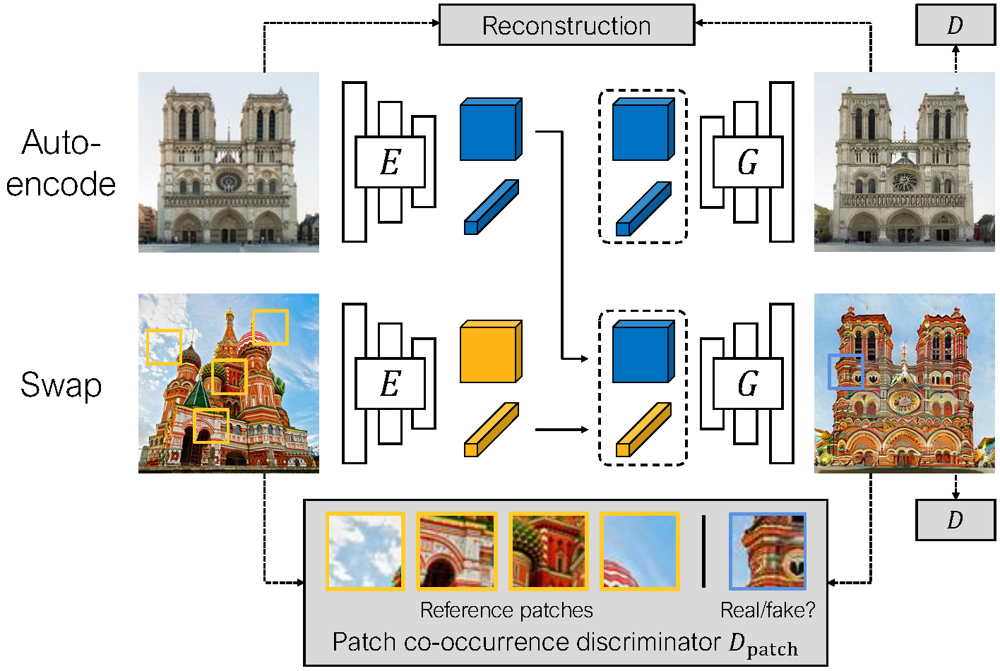
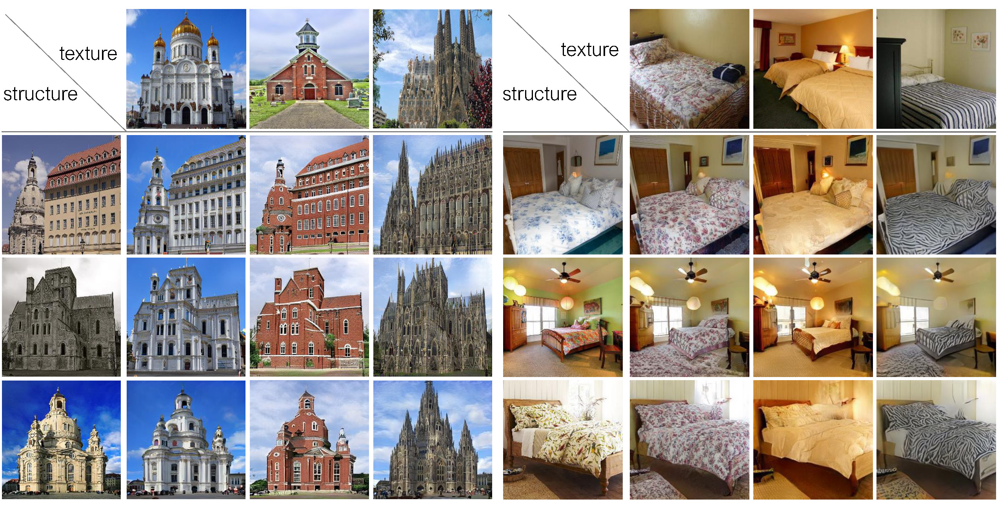

# Swapping Autoencoder for Deep Image Manipulation

[Taesung Park](http://taesung.me/), [Jun-Yan Zhu](https://www.cs.cmu.edu/~junyanz/), [Oliver Wang](http://www.oliverwang.info/), [Jingwan Lu](https://research.adobe.com/person/jingwan-lu/), [Eli Shechtman](https://research.adobe.com/person/eli-shechtman/), [Alexei A. Efros](http://www.eecs.berkeley.edu/~efros/), [Richard Zhang](https://richzhang.github.io/)

UC Berkeley and Adobe Research

NeurIPS 2020


<p float="left">
  
  
  
</p>

### [Project page](https://taesung.me/SwappingAutoencoder/) |   [Paper](https://arxiv.org/abs/2007.00653) | [3 Min Video](https://youtu.be/0elW11wRNpg)


## Overview


**Swapping Autoencoder** consists of autoencoding (top) and swapping (bottom) operation.
**Top**: An encoder E embeds an input (Notre-Dame) into two codes. The structure code is a tensor with spatial dimensions; the texture code is a 2048-dimensional vector. Decoding with generator G should produce a realistic image (enforced by discriminator D matching the input (reconstruction loss).
**Bottom**: Decoding with the texture code from a second image (Saint Basil's Cathedral) should look realistic (via D) and match the texture of the image, by training with a patch co-occurrence discriminator Dpatch that enforces the output and reference patches look indistinguishable.

## Installation / Requirements

- CUDA 10.1 or newer is required because it uses a custom CUDA kernel of [StyleGAN2](https://github.com/NVlabs/stylegan2/), ported by [@rosinality](https://github.com/rosinality/stylegan2-pytorch)
- The author used PyTorch 1.7.1 on Python 3.6
- Install dependencies with `pip install dominate torchgeometry func-timeout tqdm matplotlib opencv_python lmdb numpy GPUtil Pillow scikit-learn visdom ninja`

## Testing and Evaluation.

We provide the pretrained models and also several images that reproduce the figures of the paper. Please download and unzip them [here (2.1GB)](http://efrosgans.eecs.berkeley.edu/SwappingAutoencoder/swapping_autoencoder_models_and_test_images.zip) (Note: this is a http (not https) address, and you may need to paste in the link URL directly in the address bar for some browsers like Chrome, or download the dataset using `wget`). The scripts assume that the checkpoints are at `./checkpoints/`, and the test images at `./testphotos/`, but they can be changed by modifying `--checkpoints_dir` and `--dataroot` options.

UPDATE: The pretrained model for the AFHQ dataset was added. Please download the models and samples images [here (256MB)](http://efrosgans.eecs.berkeley.edu/SwappingAutoencoder/afhq_models_and_test_images.zip) (Note: again, you may need to paste in the link URL directly in the address bar).

### Swapping and Interpolation of the mountain model using sample images


To run simple swapping and interpolation, specify the two input reference images, change `input_structure_image` and `input_texture_image` fields of
`experiments/mountain_pretrained_launcher.py`, and run
```bash
python -m experiments mountain_pretrained test simple_swapping
python -m experiments mountain_pretrained test simple_interpolation
```

The provided script, `opt.tag("simple_swapping")` and `opt.tag("simple_interpolation")` in particular of `experiments/mountain_pretrained_launcher.py`, invokes a terminal command that looks similar to the following one.

```bash
python test.py --evaluation_metrics simple_swapping \
--preprocess scale_shortside --load_size 512 \
--name mountain_pretrained  \
--input_structure_image [path_to_sample_image] \
--input_texture_image [path_to_sample_image] \
--texture_mix_alpha 0.0 0.25 0.5 0.75 1.0
```

In other words, feel free to use this command if that feels more straightforward.

The output images are saved at `./results/mountain_pretrained/simpleswapping/`.

### Texture Swapping


Our Swapping Autoencoder learns to disentangle texture from structure for image editing tasks such as texture swapping.  Each row shows the result of combining the structure code of the leftmost image with the texture code of the top image.

To reproduce this image (Figure 4) as well as Figures 9 and 12 of the paper, run
the following command:
```bash

# Reads options from ./experiments/church_pretrained_launcher.py
python -m experiments church_pretrained test swapping_grid

# Reads options from ./experiments/bedroom_pretrained_launcher.py
python -m experiments bedroom_pretrained test swapping_grid

# Reads options from ./experiments/mountain_pretrained_launcher.py
python -m experiments mountain_pretrained test swapping_grid

# Reads options from ./experiments/ffhq512_pretrained_launcher.py
python -m experiments ffhq512_pretrained test swapping_grid
```

Make sure the `dataroot` and `checkpoints_dir` paths are correctly set in
the respective `./experiments/xx_pretrained_launcher.py` script.

### Quantitative Evaluations

To perform quantitative evaluation such as FID in Table 1, Fig 5, and Table 2, we first need to prepare image pairs of input structure and texture references images.

The reference images are randomly selected from the val set of LSUN, FFHQ, and the Waterfalls dataset. The pairs of input structure and texture images should be located at `input_structure/` and `input_style/` directory, with the same file name. For example, `input_structure/001.png` and `input_style/001.png` will be loaded together for swapping.

Replace the path to the test images at `dataroot="./testphotos/church/fig5_tab2/"` field of the script `experiments/church_pretrained_launcher.py`, and run
```bash
python -m experiments church_pretrained test swapping_for_eval
python -m experiments ffhq1024_pretrained test swapping_for_eval
```

The results can be viewed at `./results` (that can be changed using `--result_dir` option).

The FID is then computed between the swapped images and the original structure images, using https://github.com/mseitzer/pytorch-fid.

## Model Training.

### Datasets

- *LSUN Church and Bedroom* datasets can be downloaded [here](https://github.com/fyu/lsun). Once downloaded and unzipped, the directories should contain `[category]_[train/val]_lmdb/`.
- [*FFHQ datasets*](https://github.com/NVlabs/ffhq-dataset) can be downloaded using this [link](https://drive.google.com/file/d/1WvlAIvuochQn_L_f9p3OdFdTiSLlnnhv/view?usp=sharing). This is the zip file of 70,000 images at 1024x1024 resolution. Unzip the files, and we will load the image files directly.
- The *Flickr Mountains* dataset and the *Flickr Waterfall* dataset are not sharable due to license issues. But the images were scraped from [Mountains Anywhere](https://flickr.com/groups/62119907@N00/) and [Waterfalls Around the World](https://flickr.com/groups/52241685729@N01/), using the [Python wrapper for the Flickr API](https://github.com/alexis-mignon/python-flickr-api). Please contact [Taesung Park](http://taesung.me/) with title "Flickr Dataset for Swapping Autoencoder" for more details.
- *AFHQ dataset* can be downloaded [here](https://github.com/clovaai/stargan-v2/blob/master/README.md#animal-faces-hq-dataset-afhq). 

### Training Scripts

The training configurations are specified using the scripts in `experiments/*_launcher.py`. Use the following commands to launch various trainings.

```bash
# Modify |dataroot| and |checkpoints_dir| at
# experiments/[church,bedroom,ffhq,mountain]_launcher.py
python -m experiments church train church_default
python -m experiments bedroom train bedroom_default
python -m experiments ffhq train ffhq512_default
python -m experiments ffhq train ffhq1024_default

# By default, the script uses GPUtil to look at available GPUs
# on the machine and sets appropriate GPU IDs. To specify specific set of GPUs,
# use the |--gpu| option. Be sure to also change |num_gpus| option in the corresponding script.
python -m experiments church train church_default --gpu 01234567

```

The training progress can be monitored using `visdom` at the port number specified by `--display_port`. The default is https://localhost:2004. For reference, the training takes 14 days on LSUN Church 256px, using 4 V100 GPUs. 

Additionally, a few swapping grids are generated using random samples of the training set.
They are saved as webpages at `[checkpoints_dir]/[expr_name]/snapshots/`.
The frequency of the grid generation is controlled using `--evaluation_freq`.

All configurable parameters are printed at the beginning of training. These configurations are spreaded throughout the codes in `def modify_commandline_options` of relevant classes, such as `models/swapping_autoencoder_model.py`, `util/iter_counter.py`, or `models/networks/encoder.py`. To change these configuration, simply modify the corresponding option in `opt.specify` of the training script.

The code for parsing and configurations are at `experiments/__init__.py, experiments/__main__.py, experiments/tmux_launcher.py`.

### Continuing training.

The training continues by default from the last checkpoint, because the `--continue_train` option is set True by default.
To start from scratch, remove the checkpoint, or specify `continue_train=False` in the training script (e.g. `experiments/church_launcher.py`).

## Code Structure (Main Functions)

- `models/swapping_autoencoder_model.py`: The core file that defines losses, produces visuals.
- `optimizers/swapping_autoencoder_optimizer.py`: Defines the optimizers and alternating training of GAN.
- `models/networks/`: contains the model architectures `generator.py`, `discriminator.py`, `encoder.py`, `patch_discrimiantor.py`, `stylegan2_layers.py`.
- `options/__init__.py`: contains basic option flags. BUT many important flags are spread out over files, such as `swapping_autoencoder_model.py` or `generator.py`. When the program starts, these options are all parsed together. The best way to check the used option list is to run the training script, and look at the console output of the configured options.
- `util/iter_counter.py`: contains iteration counting.

## Change Log

- 4/14/2021: The configuration to train the pretrained model on the Mountains dataset had not been set correctly, and was updated accordingly. 
- 10/14/2021: The 256x256 pretrained model for the AFHQ dataset was added. Please use `experiments/afhq_pretrained_launcher.py`. 

## Bibtex
If you use this code for your research, please cite our paper:
```
@inproceedings{park2020swapping,
  title={Swapping Autoencoder for Deep Image Manipulation},
  author={Park, Taesung and Zhu, Jun-Yan and Wang, Oliver and Lu, Jingwan and Shechtman, Eli and Efros, Alexei A. and Zhang, Richard},
  booktitle={Advances in Neural Information Processing Systems},
  year={2020}
}
```
## Acknowledgment

The StyleGAN2 layers heavily borrows (or rather, directly copies!) the PyTorch implementation of [@rosinality](https://github.com/rosinality/stylegan2-pytorch). We thank Nicholas Kolkin for the helpful discussion on the automated content and style evaluation, Jeongo Seo and Yoseob Kim for advice on the user interface, and William T. Peebles, Tongzhou Wang, and Yu Sun for the discussion on disentanglement.
